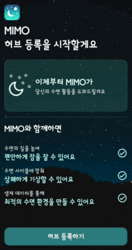
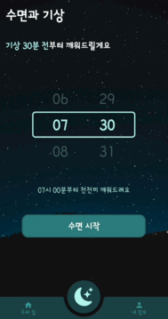
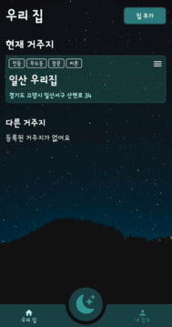
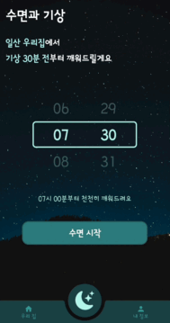
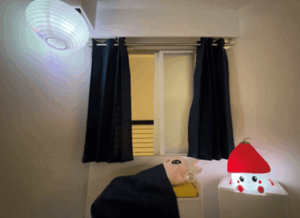

# **🌜MIMO🌛 2024.04.08 ~ 2024.05.20**

> 생체데이터를 활용한 스마트홈 기기 제어 시스템

### 당신의 **미라클한 모닝**을 만들어가는 IoT 서비스입니다.

## 🌝 목차

- [프로젝트 개요](#-프로젝트-개요)
- [주요 기능](#-주요-기능)
- [기술 소개](#-기술-소개)
- [서비스 화면](#-서비스-화면)
- [기술 스택](#-기술-스택)
- [팀원](#-팀원)

## 🌑 프로젝트 개요

### 기획 배경

- 수면 장애 및 원활한 아침 기상에 어려움을 겪는 이들이 계속해서 증가하는 추세를 보임

- 수면 장애를 겪는 이유

  - 자기 전 어두운 환경에서 스마트폰 사용
  - 빛이 차단되지 못한 환경에서의 수면 등

- 기상에 어려움을 겪는 이유

  - 악화된 수면의 질
  - 기상 시간과 수면 패턴의 불합치
  - 과도한 알람 설정 등

- 이러한 문제를 해결하기 위해 생체 데이터(수면)를 활용하여 입면 및 기상과 관련한 스마트홈 기기(알람, 무드등, 조명, 커튼, 창문 등)를 제어함으로써 사용자의 쾌적한 수면을 돕고자 함

### 사용자

- 아침 기상시간에 어려움을 겪는 사람 🥱

- 깊게 잠들고 싶은 사람 😴

- 수면 데이터를 활용하고 싶은 사람 🧐

## 🌒 주요 기능

> 1️⃣ **기상 환경 자동 제어**
>
> 기상 시 생체 데이터를 통해 미리 설정된 스마트홈 기기(알람, 무드등, 조명, 커튼, 창문 등)를 자동으로 제어

> 2️⃣ **수면 환경 자동 제어**
>
> 수면 시 생체 데이터를 통해 미리 설정된 스마트홈 기기(알람, 무드등, 조명, 커튼, 창문 등)를 자동으로 제어
>
> 수면 전 불 끈 상태로 핸드폰 사용 시 무드등을 점등함으로써 시력 보호

> 3️⃣ **App을 통한 직접 제어**
>
> 등록되어 있는 모든 스마트홈 기기(알람, 무드등, 조명, 커튼, 창문 등)를 수동으로 제어 가능

## 🌓 기술 소개

> 1️⃣ **갤럭시 워치를 통해 사용자의 생체 데이터를 수집**
>
> **갤럭시 워치**에서 사용자의 심박수, 걸음 수, 수면 정보 등 **생체데이터를 수집**합니다.  
> 수집된 데이터는 **삼성헬스 앱에 기록**되고, 갤럭시 워치와 스마트폰은 **삼성헬스 앱을 통해 생체데이터를 동기화**합니다.  
> MIMO와 같은 제 3자 애플리케이션은 **정책상**, **헬스커넥트 라이브러리를 통해 삼성헬스 데이터에 접근**하여 데이터를 가져옵니다.

> 2️⃣ **IoT 허브를 사용하여 각 IoT 기기를 BLE로 연결**
>
> IoT 기기 특성상 **이동 및 탈부착이 쉽게 하기 위해서**는 **배터리를 사용하는 것**이 좋습니다.  
> 서버와 소켓 통신을 하고 기기들과 BLE(Bluetooth Low Energy) 통신하는 **IoT 허브**를 사용하여 각 기기는 **BLE**을 통해 **전력 소모를 줄여 배터리 사용을 가능**하게 했습니다.

## 🌔 서비스 화면

### 📱 App 화면

<table>
  <tr>
    <td>
      <b>초기 설정</b> 
      <b>(허브 등록 클릭 -> QR 스캔 -> QR 등록 후 메인화면 진입)</b>
    </td>
  </tr>
  <tr>
    <td align="center">
      
    </td>
  </tr>
  <tr>
    <td>
     
      <b>메인화면</b> 
      <b>(우리 집 화면, 수면 설정 화면, 마이페이지)</b>
    </td>
  </tr>
  <tr>
    <td align="center">
      
    </td>
  </tr>
  <tr>
    <td>
     
      <b>기기 조정 화면</b>
    </td>
  </tr>
  <tr>
    <td align="center">
      
    </td>
  </tr>
  <tr>
    <td>
     
      <b>수면 설정 화면</b>
    </td>
  </tr>
  <tr>
    <td align="center">
      
    </td>
  </tr>
  <tr>
    <td>
     
      <b>집 추가</b>
    </td>
  </tr>
  <tr>
    <td align="center">
      
    </td>
  </tr>
  <tr>
    <td>
     
      <b>집 이름 바꾸기, 허브 목록 보기, 새로운 허브 추가하기</b>
    </td>
  </tr>
  <tr>
    <td align="center">
      
    </td>
  </tr>
</table>

### 🎥 시연 영상

<table>
  <tr>
    <td>
      <b>수면 시</b>
    </td>
  </tr>
  <tr>
    <td align="center">
      
    </td>
  </tr>
  <tr>
    <td>
     
      <b>기상 시</b>
    </td>
  </tr>
  <tr>
    <td align="center">
      
    </td>
  </tr>
  <tr>
    <td>
     
      <b>수면 전 핸드폰 사용 시</b>
    </td>
  </tr>
  <tr>
    <td align="center">
      
    </td>
  </tr>
</table>

## 🌕 기술 스택

- **Backend**

- **FrontEnd**

- **Embedded**

- **CI/CD**

- **협업 툴**

## 🌞 팀원

### A204 (엄마4분뒤에깨워조)

|  |   |  |
| :-----------------------------------------------------------------------------------------------: | :--------------------------------------------------------------------------------------------: | :-------------------------------------------------------------------------------------------------: |
|                         [윤동휘(팀장, BE)](https://github.com/YUNDONGHWI)                         |                          [김윤지(EM, HW)](https://github.com/yo0o0n)                           |                      [김준하(BE, HW, INFRA)](https://github.com/kimjunha1575)                       |
|    |  |     |
|                            [용상윤(FE)](https://github.com/ryong9rrr)                             |                           [이수지(BE)](https://github.com/suzy0120)                            |                           [황성재(EM, HW)](https://github.com/lacoon2874)                           |
